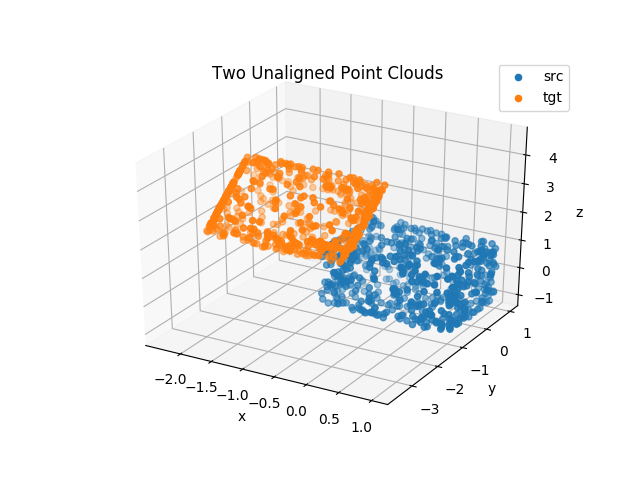
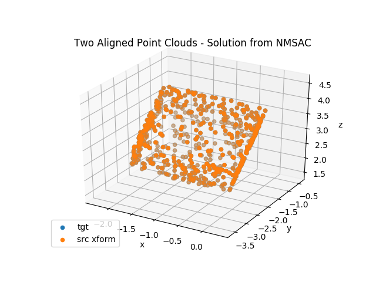

## Non-Minimal Sample Consensus `nmsac`

[](https://circleci.com/gh/jwdinius/nmsac)
[](https://coveralls.io/github/jwdinius/nmsac?branch=develop&service=github)

This repo builds on the ideas presented in the paper [SDRSAC](https://arxiv.org/abs/1904.03483) from CVPR2019.  Most of the framework comes from the original author's [matlab implementation](https://github.com/intellhave/SDRSAC), translated into C++ and using [armadillo](http://arma.sourceforge.net/) for working with matrices and vectors.  At it's core, SDRSAC is about employing a sample-and-consensus strategy, like that of [RANSAC](https://en.wikipedia.org/wiki/Random_sample_consensus).  However, with non-minimal subsampling, higher quality motion hypotheses are obtained much faster than those obtained from RANSAC.

The basic workflow to achieve non-minimal sample consensus between two point clouds, `src` and `tgt`, is:

```
Algorithm 1: NMSAC
In: src, tgt, config
Out: H, homogeneous transformation that best maps src onto tgt, number of inliers, number of iterations
Initialize
loop:
  sample a set of config.N points from src (and mark the points that have been chosen)
  loop:
    sample a set of config.N points from tgt (and mark the points that have been chosen)
    Identify correspondences between subsampled src and subsampled tgt point sets (Algorithm 2)
    Identify best fit transformation that maps subsampled src points onto subsampled tgt points using correspondences found (Algorithm 3a)
    (optional) Perform iterative alignment of original src and tgt point sets using best fit transformation as starting point (Algorithm 3b)
    count inliers and update if number is higher than all previous iterations
    check for convergence, exit both loops if converged
```

This project is built with the following goal in mind:

> Enable rapid experimentation and research by allowing users to easily integrate drop-in replacements for Algorithms 2, 3a, and 3b.

### About this Repo

This project is composed of four subprojects:

* [`nmsac` (Algorithm 1)](./nmsac)
* [`correspondences` (Algorithm 2)](./correspondences)
* [`transforms` (Algorithms 3)](./transforms)
* [`bindings`](./bindings) - *to call C++ algorithms from other languages/frameworks*

Within each subproject, you will find a separate `README` describing that subproject's particular details.

The code in each subproject follows a common standard and is well-commented.  [Unit tests](./tests) are provided for key functionality but some things may remain unclear.  If this is the case, please create an [issue](https://github.com/jwdinius/nmsac/issues).

For desired formatting, please see the script [linter.sh](scripts/linter.sh) and the [`cpplint` docs](https://github.com/cpplint/cpplint).

## Quick Start

The recommended approach is to use [`docker`](https://docs.docker.com/install/linux/docker-ce/ubuntu/), however I realize that not everyone is familiar with it.  For those users, check out the `RUN` steps in this [file](docker/deps/Dockerfile.std) to properly configure your workspace, including all steps needed to build dependencies from source.

### With `docker` (recommended)
#### Setup images
##### Grab pre-built images from `dockerhub` (recommended)
```shell
docker pull jdinius/nmsac:{desired-version}  # or jdinius/nmsac-nvidia, if the nvidia runtime is available
```

##### Build images
If you want to build the images yourself, you will first need to build the `jdinius/qap-dependencies` container.  To do this, execute the following

```shell
$ cd {repo-root-dir}/docker/deps
$ #ln -s Dockerfile.std Dockerfile  ## NOTE: do this if you do not have nvidia-docker2 installed
$ ln -s Dockerfile.nvidia Dockerfile  ## NOTE: do this if you do have nvidia-docker2 installed AND you want to use the nvidia runtime
$ ./build-docker.sh {--no-cache}  ## this will take awhile to build if you pass the `--no-cache` argument
```

Now that you have `qap-dependencies{-nvidia}` built locally, you can build the `nmsac{-nvidia}` image.  This image is incremental, and basically just sets up a user environment for working with this repo.  To build the `nmsac{-nvidia}` image, execute the following:

```shell
cd {repo-root-dir}/docker
$ ./build-docker.sh {--no-cache}  ## this will take awhile to build if you pass the `--no-cache` argument
```

#### Launch development container

```shell
cd {repo-root-dir}
$ ./docker/run-docker.sh {--runtime=nvidia}  ## only add the optional command line arg if you have the nvidia runtime available AND are using the nmsac-nvidia image
```

You should now have an interactive shell to work from.

#### Build the library

*tl;dr:  `cd` to the repo's root directory, then execute `./scripts/run_tests.sh` to run all steps mentioned below*

```shell
$ cd {repo-root-dir}
$ rm -rf build && mkdir build && cd build && cmake .. -DCMAKE_BUILD_TYPE=Release && make -j2
```
#### Test

To run the unit tests:

```shell
$ cd {repo-root-dir}/build  ## after following build steps above
$ ctest
```

To see graphical output (from python3):

```shell
$ cd {repo-root-dir} ## after following build steps above
$ export PYTHONPATH=$PYTHONPATH:$(pwd)/build/bindings/python
$ python3 ./scripts/wrapper-test.py -s
```

The command above sets up two cubes; one that is a translated and rotated copy of the second.  This example is provided as a simple proof-of-concept.  The user can load KITTI `*.bin` point cloud data and process it using the same `wrapper-test.py` script.  Check the options in the beginning of that script for more details.

## Sample Output (two cubes, no noise)

### Plot 1:  Unaligned Point Clouds


### Plot 2: Alignment after NMSAC

